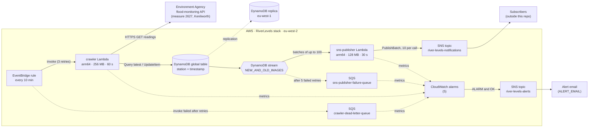
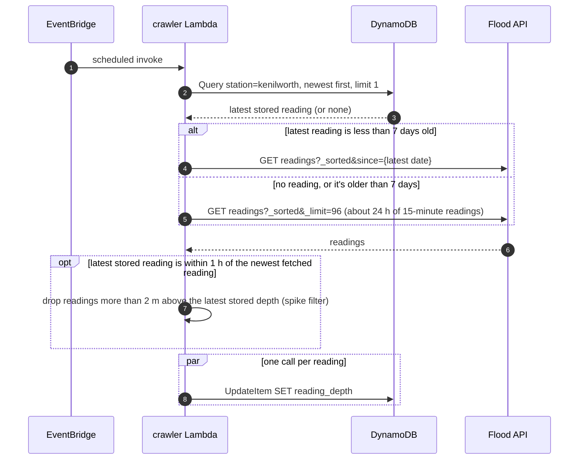
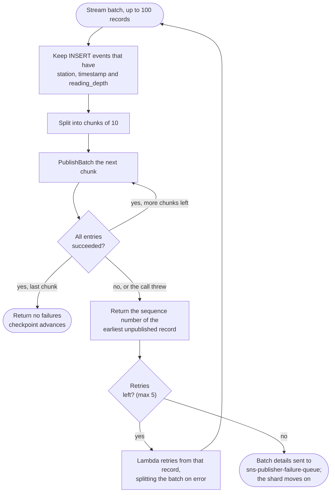
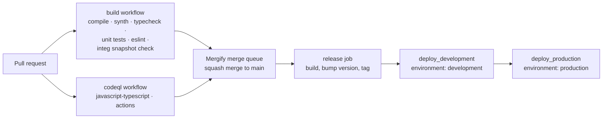

# Infrastructure

This page describes what the CDK app deploys and how data moves through it. The source of truth is the code in [`src/`](../src). If you change the infrastructure, update this page in the same PR.

- **App entry point:** [`src/main.ts`](../src/main.ts)
- **Stacks:** one, `RiverLevels` ([`StorageStack`](../src/storage-stack/index.ts))
- **Primary region:** `eu-west-2` (London), with a DynamoDB replica in `eu-west-1` (Ireland)
- **Environments:** `development` and `production`, deployed by GitHub Actions to separate AWS accounts

## Architecture



The stack also creates a CloudWatch log group per Lambda (one-year retention) and one IAM role per Lambda. X-Ray tracing is on for both Lambdas and the SNS topic.

## How a reading gets from the API to a subscriber

### 1. Crawl: every 10 minutes

[`crawler.lambda.ts`](../src/storage-stack/crawler.lambda.ts) decides how much to fetch, based on the latest reading already stored.



`UpdateItem` creates or overwrites a reading. A new key produces an `INSERT` stream event. Writing an existing key again produces a `MODIFY` event, which the publisher ignores. So re-fetching readings that are already stored doesn't send duplicate notifications.

### 2. Publish: on every stream batch

[`sns-publisher.lambda.ts`](../src/storage-stack/sns-publisher.lambda.ts) turns `INSERT` events into SNS messages:

```json
{"reading_depth": 0.694, "station": "kenilworth", "timestamp": 1718374500000}
```

`timestamp` is in epoch milliseconds and `reading_depth` is in metres. Subscribers depend on this format, so changes to it must be backward compatible.



The failure queue holds stream positions (shard and sequence numbers), not the readings themselves. To recover a batch, read its records from the table or the stream while they're still available. Stream records expire after 24 hours.

## Resources

Logical names as they appear in the CloudFormation template.

| Resource | Type | Key settings |
|----------|------|--------------|
| `river-levels-table` | `AWS::DynamoDB::GlobalTable` | Partition key `station` (S), sort key `timestamp` (N). On-demand billing. Point-in-time recovery for 35 days. Deletion protection on. Stream `NEW_AND_OLD_IMAGES`. Replica in each of `replicaRegions` (`eu-west-1`). |
| `crawler-lambda` | `AWS::Lambda::Function` | Node.js 24, arm64, 256 MB, 60 s timeout, X-Ray active. Env: `DYNAMODB_READINGS_TABLE`. |
| `crawler-cron` | `AWS::Events::Rule` | `rate(10 minutes)`, 3 retry attempts, then `crawler-dead-letter-queue`. |
| `crawler-dead-letter-queue` | `AWS::SQS::Queue` | 14-day retention, SSL enforced. Receives scheduled invocations EventBridge couldn't deliver to the crawler. |
| `sns-publisher-lambda` | `AWS::Lambda::Function` | Node.js 24, arm64, 128 MB, 30 s timeout, X-Ray active. Env: `SNS_TOPIC_ARN`. |
| `sns-publisher-lambda` event source | `AWS::Lambda::EventSourceMapping` | DynamoDB stream, starting position `LATEST`, batch size 100. `ReportBatchItemFailures` and bisect on error. 5 retries, then on-failure destination. |
| `sns-publisher-failure-queue` | `AWS::SQS::Queue` | 14-day retention, SSL enforced. Receives stream batches that still fail after retries. |
| `alarms/alerts` | `AWS::SNS::Topic` | `river-levels-alerts`. SSL enforced; not encrypted, because CloudWatch can't publish to a topic using the AWS-managed SNS key. Email subscription to `alertEmail` when set. |
| `alarms/*` | `AWS::CloudWatch::Alarm` | Five alarms, listed under [Alarms](#alarms). Each notifies the alerts topic on ALARM and on return to OK. |
| `river-levels-notifications` | `AWS::SNS::Topic` | Encrypted with the AWS-managed `alias/aws/sns` key. SSL enforced. X-Ray active. |
| `crawler-log-group`, `sns-publisher-group` | `AWS::Logs::LogGroup` | One-year retention. |

**Stack output:** `RiverLevelsTable`, the table ARN.

**Tags** on every resource: `endor:ManagedBy=cdk`, `endor:Stage` (from the `STAGE` env var: `development`, `production`, or `local` when unset), and `endor:Version` (the release tag, or `local`).

## IAM

Each Lambda has its own role under the `/service-role/` path. Both roles attach `AWSLambdaBasicExecutionRole`. CDK also adds a default policy to each role for X-Ray (because tracing is active) and, on the publisher, for its event source. Lambda Insights is not used; it was removed because of its CloudWatch cost.

| Role | Permission | Resource |
|------|------------|----------|
| `crawler-role` | `dynamodb:Query`, `dynamodb:UpdateItem` | the table |
| `sns-publisher-role` | `dynamodb:DescribeStream`, `GetRecords`, `GetShardIterator`, `ListStreams` | the table stream |
| `sns-publisher-role` | `sns:Publish` | the topic |
| `sns-publisher-role` | `sqs:SendMessage`, `GetQueueAttributes`, `GetQueueUrl` (added by CDK) | the failure queue |

## Deployment



- Both deploy jobs run `yarn deploy --require-approval never` in `eu-west-2`, with `STAGE` set to `development` or `production` for the `endor:Stage` tag.
- Both jobs also pass `ALERT_EMAIL` from the `ALERT_EMAIL` GitHub secret (a repository secret, or an environment secret to use a different address per environment). The synth fails if it is missing for a deployed stage. AWS emails a confirmation link after the first deploy, and alerts aren't delivered until it is clicked.
- Each job signs in to AWS through GitHub OIDC with the role in that environment's `AWS_DEPLOYMENT_ROLE_ARN` secret. Approval rules or required reviewers on the `production` environment are configured in GitHub, not in this repo.
- Pull requests are merged only by the Mergify queue, once `build` and `CodeQL` pass. No approval is required, because there is a single maintainer; fork PRs need their workflow runs approved first. Draft PRs and PRs labelled `do-not-merge` are held. The repository settings are described in the README's GitHub Configuration section.
- The workflow is generated from [`.projenrc.ts`](../.projenrc.ts). Change it there, not in `.github/workflows/`.
- The integ snapshot check compares the synthesized template with [`test/storage-stack/integ.storage-stack.ts.snapshot/`](../test/storage-stack/integ.storage-stack.ts.snapshot). Any change to the template needs `yarn integ:update`, which deploys a temporary stack to AWS and runs end-to-end assertions.

## Operations

- **Logs:** CloudWatch Logs groups for `crawler-lambda` and `sns-publisher-lambda`.
- **Traces:** X-Ray. The crawler records subsegments for the latest-reading lookup, the API fetch and the database writes.
- **Failed notifications:** messages arriving in `sns-publisher-failure-queue`.
- **Restore:** use DynamoDB point-in-time recovery, available for the last 35 days.

### Alarms

All alarms are in [`src/storage-stack/alarms.ts`](../src/storage-stack/alarms.ts) and email `ALERT_EMAIL` through the `river-levels-alerts` topic, both when they fire and when they recover.

| Alarm | Fires when | Where to look |
|-------|-----------|---------------|
| `crawler-errors` | The crawler reports errors in every 10-minute window for 30 minutes. One bad run (up to 3 errors with Lambda's async retries) doesn't trigger it. | Crawler logs; the flood API's availability |
| `crawler-not-running` | No crawler invocations in 30 minutes. Missing data counts as breaching. | The `crawler-cron` rule is enabled; `crawler-dead-letter-queue` |
| `crawler-dead-letters` | `crawler-dead-letter-queue` has any messages | EventBridge couldn't invoke the crawler; check its permissions and throttling |
| `sns-publisher-iterator-age` | The publisher is 15 minutes or more behind the stream for 10 minutes | Publisher logs; SNS errors or throttling |
| `sns-publisher-failures` | `sns-publisher-failure-queue` has any messages | The queued stream positions; recover readings from the table |
